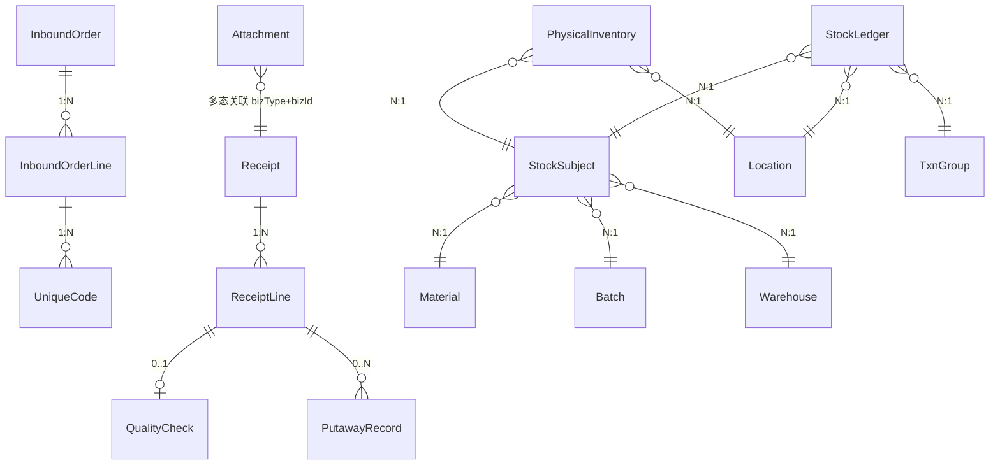

# 数据模型（草案 v0.1，C-02）

> 状态：**草案（2026-08-10，C-02，待双向评审）**。
> 依据：概念设计 v1.0、收货链工作流 v0.3.2、标签规范 v0.4、框架设计 v0.2、ADR-003/004。
> 说明：概念级数据模型，不涉及最终 SQL/EF 细节；锁定后作为 docs/api/ 契约与实现的依据。

## 一、建模原则

1. 概念命名保持（库存主体/物理库存/流水）；表名与契约字段用英文，界面词用《术语对照表》。
2. **只建本期功能需要的表**；预留概念只留字段位（如 mgmtMode/reachability），不建独立功能。
3. **流水只追加不修改**；物理库存带版本号防并发。
4. 来源单据（InboundOrder）与收货单（Receipt）分离：执行单通过"类型+单号"逻辑引用来源单（ADR-003）。

## 二、实体清单（分组）

### 系统基础（ADR-001）
User / Role / Permission / Module / MenuEntry / UserRole / RolePermission

### 主数据
Material / Warehouse / Location / Source（供应商·车间） / Batch

### 入库链
InboundOrder（入库预建单） / InboundOrderLine / UniqueCode（唯一码清单） / Receipt（收货单） / ReceiptLine / QualityCheck / PutawayRecord

### 库存账目（概念 v1.0）
StockSubject（库存主体） / PhysicalInventory（物理库存） / StockLedger（流水） / TxnGroup（事务组）

### 支撑
Attachment（附件·拍照） / PrintLog（打印留痕） / ImportTask / ImportTaskDetail

## 三、关键实体与字段（概念级）

### 主数据

| 实体 | 关键字段 | 说明 |
|---|---|---|
| Material 物料 | code(唯一)、name、batchControlled、labelType(none/sku/unique)、defaultUom、status | labelType 决定扫码行为 |
| Warehouse 仓库 | code(唯一)、name、status、**mgmtMode(manual/agv 预留)** | 多仓 |
| Location 库位 | warehouseId、code(仓内唯一)、type(staging/default)、status、**reachability(manual/agv 预留)** | 本期 staging/default |
| Source 来源 | type(supplier/workshop)、code、name、status | 供 rt/rc 查名称 |
| Batch 批次 | batchNo(唯一)、materialId、sourceBatchNo?、productionDate?、expiryDate?、sourceType?、sourceCode?、status | 内部批次号收货时生成；非批控用默认空批次 |

### 入库链

| 实体 | 关键字段 | 说明 |
|---|---|---|
| InboundOrder 入库单 | orderNo(唯一)、type(po/pr/ot)、warehouseId、sourceType?、sourceCode?、status(draft/confirmed/receiving/received/voided)、voidedBy/At/Reason | 统一表+类型（ADR-003）；作废留痕 |
| InboundOrderLine | orderId、materialId、expectedQty、lineNo、batchId?(预指定可选) | 严格策略以此数量校验 |
| UniqueCode 唯一码清单 | orderLineId、code、status(unreceived/received)、receivedAt | 仅预建单行；扫一个勾一个 |
| Receipt 收货单 | receiptNo(唯一)、warehouseId、sourceType?、sourceDocNo?、status(receiving/checking/putaway/done)、operatorId、occurredAt | 无预建单时 source 引用为空 |
| ReceiptLine | receiptId、materialId、batchId(收货时生成)、expectedQty?、actualQty、lineNo | 差异=expected vs actual |
| QualityCheck 质检 | receiptLineId、checkedQty、result(pass/exception)、exceptionReason?、photoIds?、operatorId、checkedAt | 本期全检确认；异常走主管 |
| PutawayRecord 上架 | receiptLineId?、subjectId、fromLocationId(staging)、toLocationId、quantity、recommendedLocationId?、operatorId、putawayAt | 记录推荐与最终库位 |

### 库存账目

| 实体 | 关键字段 | 说明 |
|---|---|---|
| StockSubject 库存主体 | warehouseId、materialId、batchId、status(pending_inspection/available/frozen)、uom | 唯一(仓库+物料+批次+状态)；状态待检/可用本期 |
| PhysicalInventory 物理库存 | locationId、subjectId、quantity、version | 唯一(库位+主体)；版本号乐观锁 |
| StockLedger 流水 | txnGroupId、seq、subjectId、locationId、quantity(有符号)、balanceBefore、balanceAfter、reason、sourceDocType?、sourceDocNo?、operatorId、occurredAt | 只追加 |
| TxnGroup 事务组 | groupNo(唯一)、type(receipt/quality/putaway/...)、createdAt | 复式记账组 |

### 支撑

| 实体 | 关键字段 | 说明 |
|---|---|---|
| Attachment 附件 | bizType(receipt/qc/exception/...)、bizId、fileName、mimeType、path、size、uploadedBy、uploadedAt | 本地存储（ADR-004） |
| PrintLog 打印 | bizType(receipt/batchLabel)、bizId、templateCode、printedBy、printedAt | 打印留痕 |
| ImportTask | moduleCode、fileName、status(prechecking/prechecked/executing/done/failed)、total/success/fail、resultFileUrl、operatorId | 两阶段 |
| ImportTaskDetail | taskId、rowNo、columnCode、rawValue、errorCode、errorMsg、status | 失败明细 |

## 四、关系（简化）

> InboundOrder ↔ Receipt 为**逻辑引用**（sourceType + sourceDocNo），无物理外键（ADR-003 类型路由）。

## 五、关键规则

1. **唯一性**：material.code、warehouse.code、location(warehouseId,code)、batch.batchNo、inboundOrder.orderNo、receipt.receiptNo、stockSubject(warehouse,material,batch,status)、physicalInventory(location,subject)。
2. **非批控物料用"默认空批次"实体**（batchNo=DEFAULT），保证库存主体唯一约束非空简单。
3. **流水只追加**；物理库存带 version（乐观锁）；收货/质检/上架在**同一事务**内"更新物理库存 + 追加流水"。
4. **复式记账**：内部操作同组求和=0；流水记录 balanceBefore/After（概念 §五）。
5. **作废**：InboundOrder 作废留痕，作废后不可再被收货引用。
6. **唯一码**：仅预建单行挂清单；扫一个勾一个，重复拦截。
7. **删除保护**：物料/仓库/库位被引用时禁止删除（引用保护错误码）。

## 六、待确认（C-02 评审）

1. **单据号 orderNo 全局唯一**（含类型前缀，如 PO-xxx / PR-xxx / OT-xxx）——确认？
2. **非批控物料用"默认空批次"实体**（batchNo=DEFAULT）——确认？
3. **质检/上架单独操作记录表**（留审计+待办），状态流转走流水——确认？
4. **唯一码清单表本期建**（仅预建单行）——确认？
5. **预留字段本期建字段不启用**（warehouse.mgmtMode、location.reachability）——确认？

## 七、修订记录

| 日期 | 变更 |
|---|---|
| 2026-08-10 | v0.1 初始草案 |
