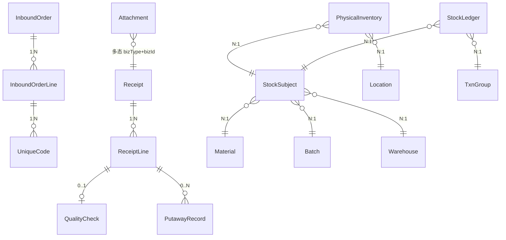

# 数据模型（草案 v0.2，C-02）

> 状态：**草案 v0.2（2026-08-10）**。v0.2：新增 Sequence（编号服务序号表）；批次改为系统自动建立。
> 依据：概念设计 v1.0、收货链工作流 v0.3.2、标签规范 v0.4、框架设计 v0.2、ADR-003/004、通用规范 v1.1。

## 一、建模原则

1. 概念命名保持；表名与契约字段英文，界面词用《术语对照表》。
2. 只建本期功能需要的表；预留概念只留字段位。
3. 流水只追加；物理库存带版本号防并发。
4. 来源单据与收货单分离（逻辑引用，ADR-003）。

## 二、实体清单（分组）

### 系统基础
User / Role / Permission / Module / MenuEntry / UserRole / RolePermission

### 主数据
Material / Warehouse / Location / Source / Batch（**系统自动建立**）

### 入库链
InboundOrder / InboundOrderLine / UniqueCode / Receipt / ReceiptLine / QualityCheck / PutawayRecord

### 库存账目
StockSubject / PhysicalInventory / StockLedger / TxnGroup

### 支撑
Attachment / PrintLog / ImportTask / ImportTaskDetail / **Sequence（编号序号表）**

## 三、关键实体与字段（概念级）

### 主数据

| 实体 | 关键字段 | 说明 |
|---|---|---|
| Material | code(唯一)、name、batchControlled、labelType(none/sku/unique)、defaultUom、status | labelType 决定扫码行为 |
| Warehouse | code(唯一)、name、status、mgmtMode(预留) | 多仓 |
| Location | warehouseId、code(仓内唯一)、type(staging/default)、status、reachability(预留) | — |
| Source | type(supplier/workshop)、code、name、status | rt/rc 查名称 |
| Batch | batchNo(唯一)、materialId、sourceBatchNo?、productionDate?、expiryDate?、sourceType?、sourceCode?、status | **系统自动建立**（收货时生成；退料复用） |

### 入库链

| 实体 | 关键字段 | 说明 |
|---|---|---|
| InboundOrder | orderNo(唯一)、type(po/pr/ot)、warehouseId、sourceType?、sourceCode?、status、voidedBy/At/Reason | 统一表+类型；作废留痕 |
| InboundOrderLine | orderId、materialId、expectedQty、lineNo、batchId? | 严格策略校验 |
| UniqueCode | orderLineId、code、status(unreceived/received)、receivedAt | 仅预建单行；扫一个勾一个 |
| Receipt | receiptNo(唯一)、warehouseId、sourceType?、sourceDocNo?、status、operatorId、occurredAt | 逻辑引用来源单 |
| ReceiptLine | receiptId、materialId、batchId(收货时生成)、expectedQty?、actualQty、lineNo | 差异记录 |
| QualityCheck | receiptLineId、checkedQty、result(pass/exception)、exceptionReason?、photoIds?、operatorId、checkedAt | 本期全检 |
| PutawayRecord | receiptLineId?、subjectId、fromLocationId、toLocationId、quantity、recommendedLocationId?、operatorId、putawayAt | 记录推荐与最终库位 |

### 库存账目

| 实体 | 关键字段 | 说明 |
|---|---|---|
| StockSubject | warehouseId、materialId、batchId、status(pending/available/frozen)、uom | 唯一(仓库+物料+批次+状态) |
| PhysicalInventory | locationId、subjectId、quantity、version | 唯一(库位+主体)；乐观锁 |
| StockLedger | txnGroupId、seq、subjectId、locationId、quantity(有符号)、balanceBefore、balanceAfter、reason、sourceDocType?、sourceDocNo?、operatorId、occurredAt | 只追加 |
| TxnGroup | groupNo(唯一)、type、createdAt | 复式记账组 |

### 支撑

| 实体 | 关键字段 | 说明 |
|---|---|---|
| Attachment | bizType、bizId、fileName、mimeType、path、size、uploadedBy、uploadedAt | 本地存储 |
| PrintLog | bizType、bizId、templateCode、printedBy、printedAt | 打印留痕 |
| ImportTask / ImportTaskDetail | 两阶段导入任务与失败明细 | — |
| **Sequence** | **type(唯一)、bizDate、lastNo、prefix、length** | **编号服务序号表：按 (type,bizDate) 原子自增（通用规范 2.9）** |

## 四、关系（简化）

## 五、关键规则

1. 唯一性：material.code、warehouse.code、location(warehouseId,code)、batch.batchNo、order.orderNo、receipt.receiptNo、subject(warehouse,material,batch,status)、physical(location,subject)。
2. 非批控物料用默认空批次（batchNo=DEFAULT）。
3. 流水只追加；物理库存带 version；收货/质检/上架同一事务"更新物理库存+追加流水"。
4. 复式记账：内部操作同组求和=0；流水记录 balanceBefore/After。
5. 作废留痕；唯一码防重；删除保护。
6. **编号统一走 NumberingService**（Sequence 表），格式见通用规范 2.9。

## 六、修订记录

| 日期 | 变更 |
|---|---|
| 2026-08-10 | v0.1 初始草案 |
| 2026-08-10 | v0.2：新增 Sequence 表；批次系统自动建立 |
