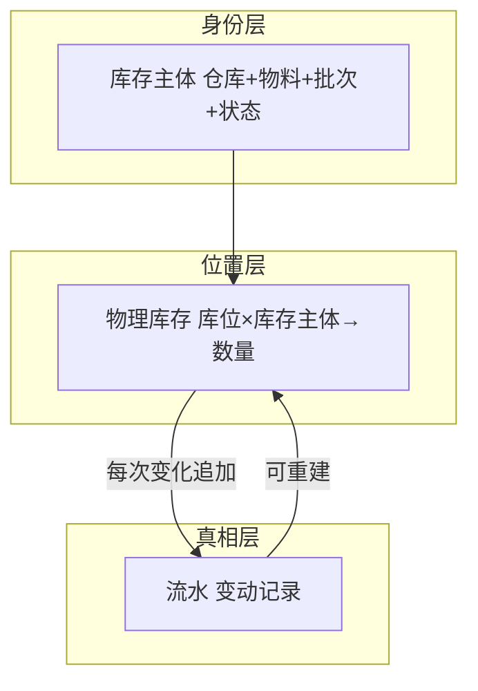
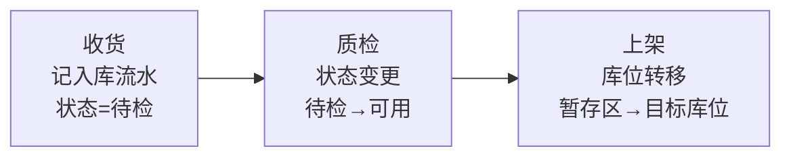

# 库存概念设计（已定稿 v1.0）

> 状态：**已定稿 v1.0（2026-08-10，用户确认）**。来源：references/库存账目概念设计.md（评审采纳）+ AWms 已确认决议。
> 界面词按《术语对照表》（库存主体→库存、物理库存→库位库存、库存流水→库存流水）。
> 本文档是概念层标准：不涉及表结构/字段命名（契约批细化）。

## 一、核心需求（保留）

仓库管理的本质围绕"库存"有两件事：

1. **实时库存**：有哪些货、在哪些位置、各有多少。
2. **追溯**：任何一件货，从哪来、到哪去——入库从哪个单据来、出库到了哪个单据、中间经过哪些位置。

现状（物理库存/库位库存）与历史（流水）相互支撑：现状可信依赖完整历史，追溯从现状出发。

## 二、核心概念（保留 + AWms 调整）

| 概念 | 回答的问题 | AWms 说明 |
|---|---|---|
| 物料 | 这是什么货 | 含"标签类型"属性（无/SKU码/唯一码） |
| 批次 | 这批货的来历 | **内部批次号收货时生成**；属性=来源批号/生产日期/效期；非批控用默认空批次；生产退料可复用原批次 |
| 状态 | 这批货能不能用 | 待检 / 可用 / 冻结（**本期实现待检/可用，冻结字段预留**） |
| 库位 | 货放在哪 | 本期类型：staging（暂存）/ default（默认）；后续扩展（shipping 等） |
| 库存主体 | 这批货是谁 | 仓库+物料+批次+状态 唯一定位（界面词：库存） |
| 物理库存 | 现在有多少、在哪 | 库位×库存主体→数量（界面词：库位库存） |
| 流水 | 历史上发生了什么 | 每次库存变化记一条（界面词：库存流水） |
| 来源单据（入库类型） | 这批货从哪来 | PO=采购 / PR=生产 / OT=其他 → 数量一致性策略（严格/宽松） |
| 收货单 | 本次收货的执行记录 | 独立统一执行单，引用来源单据（可为空） |
| 标签 | 扫码载体 | 外标签/唯一码/批次标签（标签规范 v0.4） |
| 库位可达性（预留） | AGV 能不能到这个库位 | AGV 可达 / 仅人工（本期不启用，见 ADR-002） |

## 三、模型分层（保留）

**核心思想：流水是真相，物理库存是投影。**

## 四、身份维度判断标准（保留）

> **这个维度变了，两堆货还能不能混在一起发？不能混 → 身份维度。**

仓库 / 物料 / 批次 / 状态 是身份维度；单位不是身份（可换算混发），但作为数量字段的解释器保留在主体上。

## 五、复式记账与事务组（保留，本期实现）

- 同一次操作的多次变动共享一个事务组；**内部操作组内求和=0**（移库/状态变更），**外部操作≠0**（入/出/盘盈盘亏）。
- 每次变动记录：归属（事务组/主体/库位/批次/状态）、数量（有符号 + **变动前后余额**）、来源（原因/单据/操作人/时间）。

## 六、记账分界线（保留）

| 变化 | 是否记流水 |
|---|---|
| 数量变化（入/出/移/盘/调） | 记 |
| 状态变化（待检→可用） | 记（同组求和=0） |
| 库位类型/属性变化 | 不记（动的是"位置的定义"） |

## 七、入库链路账目流转（保留，与工作流一致）

- 待检是**状态**（业务不可用），不是库位类型。
- 生产退料复用原批次：不生成新批次号，但按当前状态新建库存主体（一般走待检）。

## 八、实时库存与可用量（保留概念，本期简化）

- 三种约束本质不同：**冻结=状态变更**（进账目）、**盘点=位置锁定**（不进账目）、**出库预留=数量额度**（不进账目）。
- 完整公式：可用量 = Σ(状态=可用 且 库位未盘点锁定) − 预留（未释放）。
- **本期简化**：可用库存 = Σ(状态=可用) 的主体合计；冻结/盘点/预留功能后置，公式与机制概念保留。

## 九、追溯（本期范围）

- 数量层追溯：流水（本期实现）。
- 个体层追溯（HU/搬运单元）：**本期明确不做**，概念保留引用，后置。

## 十、预留概念（ADR-002）

- 仓库管理方式：人工 / AGV。
- 库位可达性：AGV 可达 / 仅人工（AGV 运行逻辑限制，如地堆库位不可达）。
- 任务执行主体：人 / AGV / 外部系统（为任务派发与状态回告留位）。

## 十一、修订记录

| 日期 | 变更 |
|---|---|
| 2026-08-09 | v0.1 初稿 |
| 2026-08-10 | v1.0 定稿：用户确认 5 点（状态集/库位类型/复式记账/可用量口径/HU 后置） |
