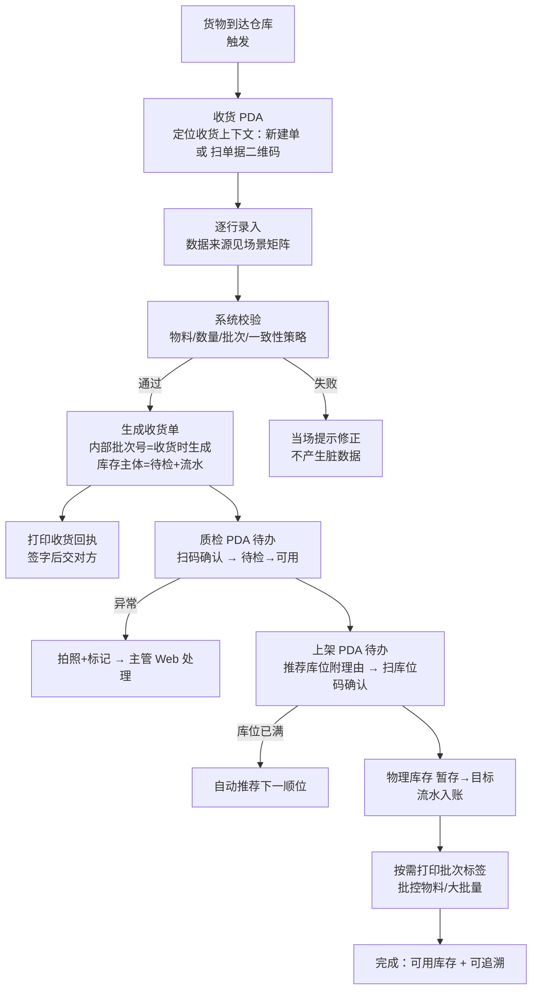

# 工作流：收货链（收货 → 质检 → 上架）（草案 v0.2，讨论中）

> 状态：**草案 v0.2（2026-08-09，讨论中）**。v0.2 新增：收货场景矩阵、数量一致性策略、两阶段标签与批次时机、打印策略、PDA 两种作业模式。
> 关联：角色卡《收货链角色卡-草案》、概念《库存账目概念设计（参考）》、ADR-001/002。

## 一、流程总览

## 二、收货场景矩阵（4 场景 = 同一流程，数据来源不同）

| 场景 | 有无预建单据 | 物料是否贴标签 | 行数据来源 | 数量录入 |
|---|---|---|---|---|
| 1 | 无 | 不贴 | 手动选物料（+选批次） | 大键盘输入 |
| 2 | 有 | 不贴 | 扫单据二维码 → 行预载 | 填数量（或整行确认） |
| 3 | 无 | 贴（SKU 码/唯一码） | 扫物料标签 → 带出物料 | 标签含数量则自动，否则输入/累加 |
| 4 | 有 | 贴（SKU 码/唯一码） | 扫单据 → 行预载 → 扫物料标签匹配 | 确认数量 |

**关键点**：4 个场景走同一条"收货 → 校验 → 入账 → 回执 → 质检 → 上架"流程，区别只在**行的数据从哪里来**。PDA 根据"有没有扫单据、扫到的是什么码"自动切换，操作员不需要理解"模式"。

## 三、码的唯一性：是物料主数据的属性，决定扫码行为

| 码类型 | 含义 | 扫码行为 |
|---|---|---|
| 非唯一码（SKU 码） | 同 SKU 多箱同码，不区分个体 | 扫一次 = 定位物料（+批次），数量 +1 或输入；可连扫累加 |
| 唯一码（箱码/SSCC/序列号） | 每件/每箱唯一 | 扫一个 = 收一件/一箱；**重复扫 = 拦截报错（防重复收货）**；数量由码决定 |

- 码类型作为物料主数据的一个属性（标签类型：无标签 / SKU 码 / 唯一码），成本很低。
- **唯一码本期只与预建单据结合**：单据行挂唯一码清单（预建时录入/导入），扫一个勾一个、重复拦截；无预建单据时系统无法识别未知唯一码，退回 SKU 码或手选（见"明确不做"）。

## 四、数量一致性策略：按入库类型区分（解决"采购严、退料松"的态度差异）

| 入库类型 | 策略 | 行为 |
|---|---|---|
| 采购到货（采购单） | **严格一致** | 数量必须 = 单据数量；要改数量 → 先修订单据（改行后重新打印送货单/单据）→ 再收货 |
| 生产退料 / 其他入库 | **宽松（按实收）** | 按实物数量收货，差异自动记录在收货单上（应到 vs 实收），不阻断 |

- "态度差异"不要做成不同流程，做成**单据上的策略字段**：来源类型 → 数量校验策略（本期实现"严格/宽松"两种硬编码，容差规则后置）。
- 严格策略下"修订单据"本期做简单版：单据未收货前允许改行数量，改动后重新打印。

## 五、标签与批次时机：两阶段标签（化解"批次号前后为难"）

**结论：内部批次号在收货时由系统生成（收货后产生）；标签分两类，各司其职，不存在"同一张标签打两次"。**

| 标签 | 时机 | 内容 | 用途 |
|---|---|---|---|
| 外标签（物料码） | 收货前（供应商自带或仓库预贴） | SKU 码 +（可选）供应商批次/生产日期；**不含内部批次号** | 场景 3/4 的扫料 |
| 批次标签 | 收货后按需 | SKU + 内部批次号 + 数量 + 建议库位 | 批控物料的批次追溯与库位标识 |

- **收货前产生内部批次的顾虑（泄露业务量）**：外标签不含内部批次号 → 外界看不到业务量。
- **收货后产生批次的顾虑（标签要打两次）**：其实不是"同一张标签打两次"，而是"外标签"（收货前，用于扫码）与"批次标签"（收货后，用于追溯）本来就是两张职责不同的标签。非批控物料收货后连批次标签都不用打。
- 供应商批次/生产日期若在外标签上，收货时扫入作为批次属性，不影响内部批次号。

## 六、打印策略

| 打印物 | 时机 | 大批量 | 小批量 |
|---|---|---|---|
| 收货回执（=收货单） | 收货提交后提示打印 → 收货员签字 → 交对方；Web 可补打 | 按单打 1 张 | 按单打 1 张 |
| 批次标签 | 上架时/收货后按需 | **按单据行 × 箱数批量打印**（一次 N 张） | 1 张贴在单据/首箱即可 |
| 库位标签 | 上架时按需（后续） | 同左 | 同左 |

## 七、PDA 两种作业模式（解决大批量/小批量差异）

| 模式 | 适用 | 交互 |
|---|---|---|
| 逐项模式（默认） | 小批量、零散收货 | 扫一个收一个；非唯一码连扫累加；唯一码逐件勾销 |
| 批量模式 | 大批量、整托/整箱 | 扫单据 → 行预载 → **整行确认**（数量=应到，严格策略下）或连扫累加到行；提交后批量打印批次标签 |

- 托盘码（整托一键收）本期不做：用"批量模式 + 整行确认"代替，减少一个概念。

## 八、步骤详表（v0.1 保持，微调）

| 步骤 | 角色/终端 | 动作 | 信息需求 | 系统校验 | 异常路径 | 产出 |
|---|---|---|---|---|---|---|
| 1 收货 | 作业员/PDA | 定位上下文（新建/扫单）→ 逐行录入（手动/扫料/双扫）→ 拍照可选 → 提交 | 物料/单位/是否批控/数量/策略 | 物料存在、数量合法、批控必选批次、一致性策略 | 物料无码→补打外标签；差异→按策略拦截或记录 | 收货单（待检主体+流水+内部批次） |
| 2 回执 | 作业员 | 打印收货回执 → 签字 → 交对方 | 收货单内容 | — | 打印失败→Web 补打 | 签字回执 |
| 3 质检 | 作业员/PDA | 待办 → 扫码确认 → 提交 | 应检数量 | 状态=待检 | 破损/差异→拍照+标记→主管处理 | 待检→可用；流水 |
| 4 上架 | 作业员/PDA | 待办 → 推荐库位（附理由）→ 扫库位码 → 提交 | 推荐库位+理由 | 类型匹配/容量/先扫库位码 | 库位满→下一顺位 | 物理库存入账；流水 |
| 5 标签 | 作业员 | 按需打印批次标签（批量模式可一次 N 张） | 批次/SKU/数量/库位 | — | — | 批次标签 |

## 九、概念挂钩（本期验证）

- 库存主体（仓库+物料+批次+状态：待检→可用）；内部批次号收货时生成
- 物理库存（暂存→目标）；流水（真相层）
- 来源单据类型 → 数量一致性策略（严格/宽松）
- 物料标签类型（无/SKU 码/唯一码）作为物料属性
- 库位可达性（预留，见 ADR-002）

## 十、明确不做（本期）

- ASN 到货预报管理（只留来源单据号/单据类型）
- 免检/抽检/全检规则（质检=全检确认）
- 打印模板配置界面（内置固定模板）
- 导出自定义列/方案保存
- 容差规则（如 ±5%）：本期只有"严格/宽松"两档
- 托盘码收货（用批量模式+整行确认代替）
- 唯一码全局登记（唯一码仅与预建单据结合）
- AGV 任务派发（只留概念位）

## 十一、待讨论问题（状态更新）

| 问题 | 状态 |
|---|---|
| 质检岗位：同人顺带做 | ✅ 已确认（未来可拆岗） |
| 数量录入：非唯一码连扫累加 | ✅ 已确认；唯一码改为"防重拦截"，按码类型区分 |
| 小差异容差 | ✅ 已确认不做；按"严格/宽松"策略替代 |
| 上架库位推荐 | ✅ 已确认：简单推荐+理由 |
| 收货单打印 | ✅ 已确认：提交后提示可打印、Web 可补打 |
| 4 收货场景矩阵 | 🟡 讨论中（v0.2 已给出统一流程映射） |
| 批次号时机 / 两阶段标签 | 🟡 讨论中（v0.2 建议：收货后产生 + 两阶段标签） |
| 数量一致性策略（采购严/退料松） | 🟡 讨论中（v0.2 建议：按来源类型策略化） |
| 唯一码支持范围 | 🟡 讨论中（v0.2 建议：仅与预建单据结合） |
| 大批量模式 | 🟡 讨论中（v0.2 建议：逐项/批量两模式） |

## 十二、修订记录

| 日期 | 变更 |
|---|---|
| 2026-08-09 | v0.1：初始草案 |
| 2026-08-09 | v0.2：场景矩阵/一致性策略/两阶段标签/打印策略/PDA 双模式 |
