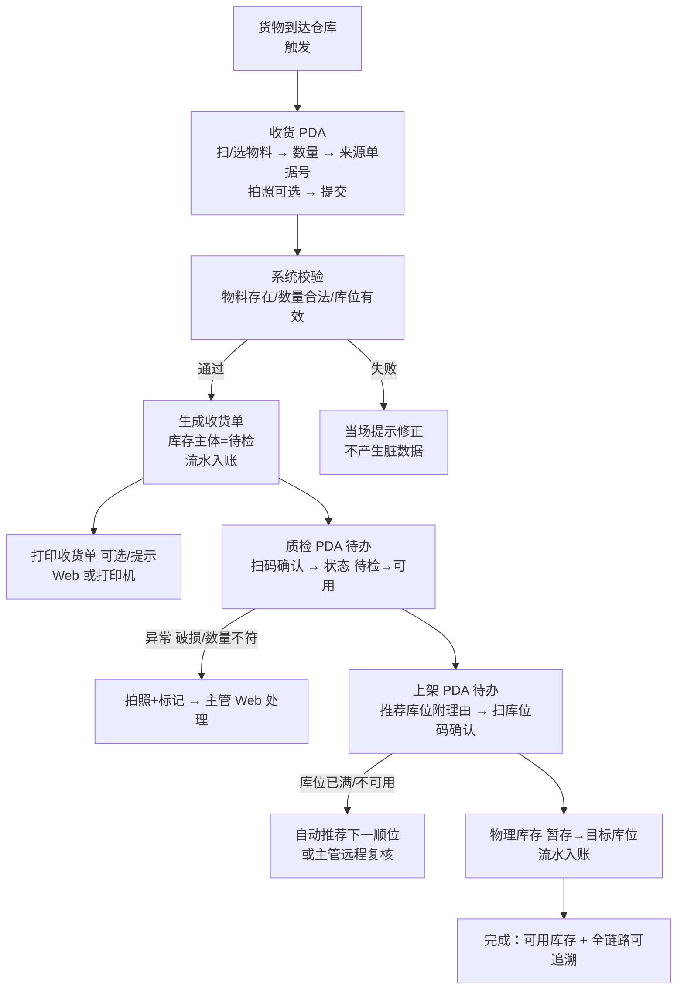

# 工作流：收货链（收货 → 质检 → 上架）（草案 v0.1，待讨论）

> 状态：**草案**，第 1 批（设计批）讨论中。
> 关联：角色卡《收货链角色卡-草案》、概念《库存账目概念设计（参考）》、ADR-001/002。

## 一、流程总览

## 二、步骤详表

| 步骤 | 角色/终端 | 动作 | 信息需求 | 系统校验 | 异常路径 | 产出 |
|---|---|---|---|---|---|---|
| 1 收货 | 作业员/PDA | 选仓库（记住上次）→ 扫/选物料 → 数量 → 来源单据号（可空）→ 拍照（可选 1-3 张）→ 提交 | 该物料名/单位/是否批控；暂存库位 | 物料存在、数量>0、批控必选批次、库位有效 | 物料无码→补打标签；数量/物料填错→当场提示 | 收货单（待检主体+流水） |
| 2 打印 | 作业员/Web | 收货完成后可打印收货单（内置模板，含单号/物料/数量/来源/时间/拍照备注） | 收货单内容 | — | 打印失败→可稍后在 Web 补打 | 纸质收货单 |
| 3 质检 | 作业员/PDA | 待办列表 → 扫码选中主体 → 确认数量 → 提交 | 应检数量、来源信息 | 状态必须=待检；数量>0 | 破损/数量不符→拍照+标记→主管 Web 处理 | 状态 待检→可用；流水 |
| 4 上架 | 作业员/PDA | 待办列表 → 看推荐库位（附理由）→ 扫库位码确认 → 提交 | 推荐库位+理由、数量 | 目标库位类型匹配/容量足够；必须先扫库位码 | 库位已满→自动推荐下一顺位；跨仓/错类型禁选 | 物理库存 暂存→目标；流水 |

## 三、设计要点（来自调研，已采纳）

1. **一屏一任务**：PDA 每屏只做一步，成功后自动进入下一步/下一单。
2. **扫码为主、手动输入最少**：物料/库位靠扫码；数量用大数字键盘；已知信息系统预填。
3. **校验前置**：每次提交前系统校验，失败当场提示，不产生脏数据、不做一半。
4. **状态流转可见**：待检（amber）→ 可用（emerald）；待办实时出现（收货提交后质检待办立即可见）。
5. **异常内置在流程里**：破损/差异一键拍照+上报；库位满自动给下一顺位；主管在 Web 处理，不用到现场。
6. **环节预热**：收货提交即生成质检待办，质检通过即生成上架待办，无等待。
7. **追溯闭环**：每次变动写流水；收货照片与收货单关联，Web 可查可导出。

## 四、概念挂钩（本期验证的概念）

- 库存主体（仓库+物料+批次+状态：待检→可用）
- 物理库存（库位×主体→数量；暂存→目标）
- 流水（真相层，每次变动追加）
- 来源单据号（自由文本，为未来 ASN/采购单留位）
- 库位可达性（本期不启用，字段预留，见 ADR-002）

## 五、明确不做（本期）

- ASN 到货预报管理（只留来源单据号字段）
- 免检/抽检/全检规则（本期质检=全检确认）
- 打印模板配置界面（内置 1-2 个固定模板）
- 导入导出自定义列/方案保存（本期标准模板 + 两阶段校验）
- AGV 任务派发（只留概念位）

## 六、待讨论问题（第 1 批内解决）

1. 质检岗位：收货员顺带做，还是独立质检员？（影响角色卡与待办设计）
2. 数量录入：默认大数字键盘手输；是否支持"再扫一次同码=数量+1"这类快捷方式？
3. 小差异容差：本期做不做（如 ±5% 按实收，超出需主管）？默认：不做容差，差异一律主管介入。
4. 上架库位推荐：本期用"同物料集中 > 空库位按类型"的简单规则附理由，还是纯人工选？
5. 打印时机：收货提交后立即打印（默认），还是攒批打印？
