> 状态：参考输入（来自旧项目 MWms，2026-08-09 引入）
> 仅保留"库存账目"的概念作为本项目后端设计阶段的参考；**不是本项目的既定标准**，采纳前需在概念设计中评审确认。

---

# 库存账目概念设计

> 本文档描述库存账目的**概念与理念**，是后续详细设计的依据。
> 不涉及具体表结构、字段命名——那些在详细设计阶段确定。
> 不涉及任务/执行层——任务模块单独设计，本库存账目设计独立于任务。

---

## 一、核心需求

仓库管理的本质，围绕"库存"有两件事：

1. **实时库存**：我随时能知道，**有哪些货、在哪些位置、各有多少**。
2. **追溯**：任何一件货，我能知道它**从哪来、到哪去**——入库从哪个单据来、出库到了哪个单据、中间经过哪些位置。

这两件事相互支撑：实时库存是"现状"，追溯是"历史"。要保证"现状可信"，必须有完整的历史；要追溯历史，必须从"现状"出发。

---

## 二、围绕实时库存的概念

### 2.1 核心概念

| 概念 | 回答的问题 | 说明 |
|---|---|---|
| **物料** | 这是什么货 | 货物的种类定义 |
| **批次** | 这批货的来历 | 独立实体，有生命周期和属性（生产日期、效期、供应商等）；非批控物料用默认空批次 |
| **状态** | 这批货能不能用 | 货的业务可用性：可用/待检/冻结等 |
| **库位** | 货放在哪 | 物理位置；有可扩展的类型（默认/在途/暂存/复核等） |
| **库存主体** | 这批货是谁 | 由 仓库+物料+批次+状态 唯一定位，是库存的"身份" |
| **物理库存** | 现在有多少、在哪 | 由 库位×库存主体 定位，记录数量，是实时库存的真相 |
| **流水** | 历史上发生了什么 | 每次库存变化记一条，是账目的真相 |

### 2.2 概念如何配合（模型分层）

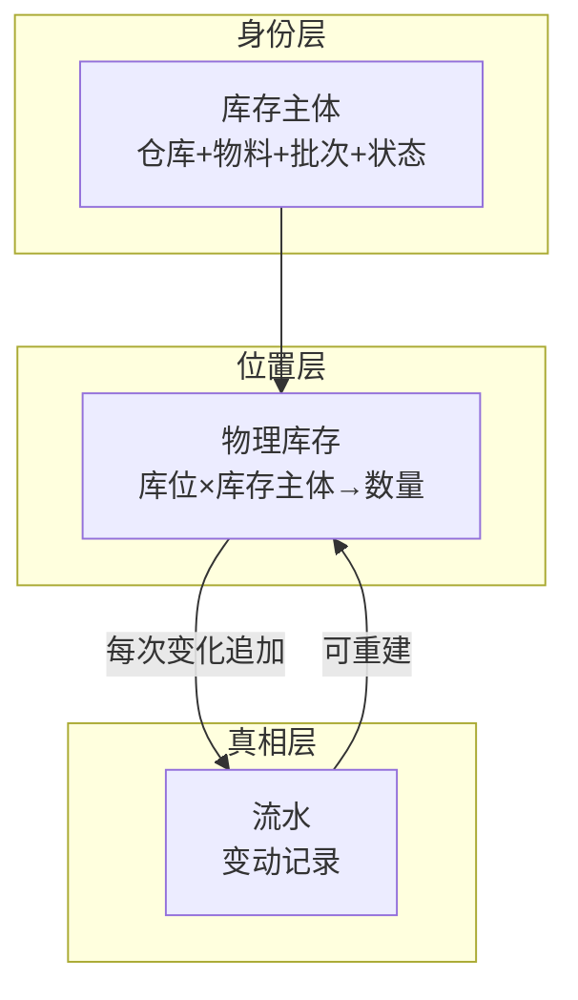

**核心思想：流水是"真相"，物理库存是"投影"。**

- 物理库存是当前状态，流水是全部历史
- 任何一笔库存变动，既更新物理库存（投影），又追加流水（真相）
- 理论上，可以从流水完整重建物理库存

### 2.3 身份维度的判断标准

一个维度是否进入"库存主体"（身份），标准是：

> **这个维度变了，两堆货还能不能混在一起发？不能混 → 身份维度。**

| 维度 | 为什么是身份 |
|---|---|
| 仓库 | 归属不同的货不能混用 |
| 物料 | 不同物料不是同一堆货 |
| 批次 | 不同批次必须隔离追溯 |
| 状态 | 状态不同的货不能混用 |

单位不是身份维度（不同单位的货可以换算混发），但它是**数量字段的解释器**——保留在库存主体上，让数量有意义，且避免因物料基准单位变更而影响历史账目。

### 2.4 复式记账：流水如何保持可信

一次库存变动可能影响多个库存记录。为保证账目可信，采用**复式记账**：同一次操作的多次变动，共享同一个"事务组"，同组内数量求和有校验意义。

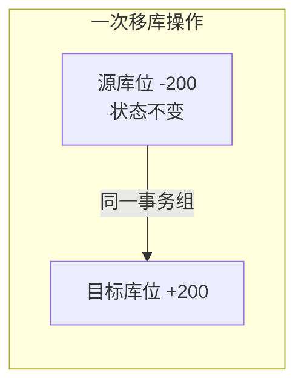

- **内部操作**（移库/状态变更/库位转移）：组内求和 = 0——借贷平衡，货只是系统内搬动
- **外部操作**（入库/出库/盘盈/盘亏）：组内求和 ≠ 0——货跨越了系统边界。盘盈/盘亏即盘点时实盘数量与账面数量的差额（实盘多于账面为盘盈，少于为盘亏）

这条规则让账目自校验：一笔内部操作如果不平衡，说明记错了。同时，按事务组聚合，能还原一次操作的完整来龙去脉。

**每次变动记录应包含**：
- 归属：事务组、组内序号、涉及的库存主体、库位、批次、状态
- 数量：变动数量（有符号）、**变动前余额、变动后余额**（必须同时记录，单行自含上下文，审计无需回溯）
- 来源：变动原因、来源单据、操作人、发生时间

### 2.5 记账分界线：什么记流水，什么不记

| 变化 | 是否记流水 | 原因 |
|---|---|---|
| 库存数量变化（入/出/移/盘/调） | **记** | 货动了 |
| 库存状态变化 | **记** | 状态是身份维度，变了=另一堆货，旧减新加，同组求和为 0 |
| 库位类型变化 | **不记** | 库位类型是"位置的定义"，不是货的变化 |
| 库位属性变化（地址/名称等） | 不记 | 同上 |

**一句话**：改状态动了"货"，改类型动了"位置的定义"。动货要记账，动位置定义不用。

---

## 三、围绕追溯的概念

### 3.1 追溯的两个层次

| 层次 | 追溯单位 | 回答的问题 | 依托 |
|---|---|---|---|
| **数量层** | 物料/批次 | 这个批次进过哪些单、出了多少、剩多少 | 流水 |
| **个体层** | 唯一码/HU | 这件货从哪来、到哪去、现在在哪 | HU 追溯 |

唯一码（如序列号、条码）是贴在单件货上的识别编码；HU 则是"独立可移动的最小物理对象"这一聚合概念，一个 HU 可以承载多个唯一码（如整箱的瓶）。数量层追溯靠流水（账目层），个体层追溯靠 HU。两者针对不同需求：查"批次的来龙去脉"用数量层，查"某个唯一码的个体旅程"用个体层。

### 3.2 HU（搬运单元）概念

**HU（Handling Unit，搬运单元）** 是仓库内可独立识别、可独立移动的最小物理对象——可以是托盘、料箱、盒、瓶，只要它贴了码、值得单独追踪。

**装载明细**是 HU 上的内容清单：每一条记录这个 HU 装了哪批货（对应哪个库存主体/批次）以及装了多少。一个 HU 可以有多条装载明细（装了几种货）。它与下文的**一致性约束**对应：物理库存（库位×库存主体）的数量 = 其下所有 HU 装载明细数量之和。装载明细是"HU 码 → 批次 → 来源单据"这条追溯链的起点。

HU 的价值：**连接"聚合的账"和"独立的个体"**。

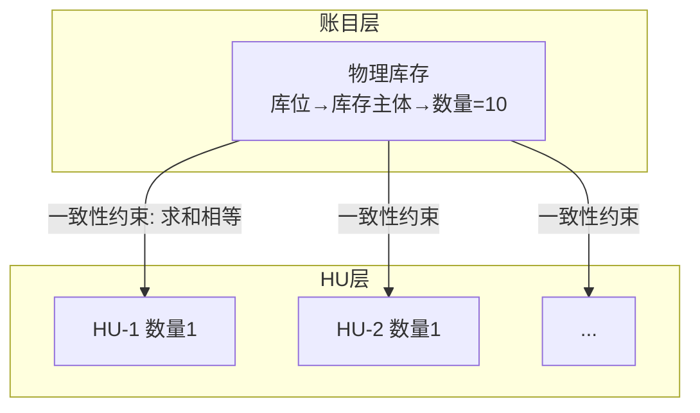

**一致性约束**：物理库存的数量 = 其下所有 HU 装载明细的数量之和。任何操作后，两层必须对得上。

### 3.3 HU 与库存的关系

- **账目合并记数量**：同一库存主体下的所有 HU，在账目层只是一条物理库存（数量=总数）。账目回答"有多少"，不回答"哪个个体"。
- **HU 承载个体**：每个 HU 是独立的个体，记录它装了什么、在哪。
- **唯一码是追溯属性，不是账目维度**：需要时在 HU 上追踪，但不改变账目的合并结构。

```
账目层：物理库存 (库位, 库存主体) → 数量=10     ← 合并，只问有多少
   ↑ 一致性约束
HU 层：10 个 HU，每个关联同一库存主体            ← 具体，只问是哪颗
```

### 3.4 HU 的生命周期与追溯

HU 从创建到出库，经历一系列事件。**HU 追溯**记录这些事件，构成这个 HU 的"一生"。

**事件类型**：创建、装载、卸载、移动、拆分、合并、嵌套、出库、作废。

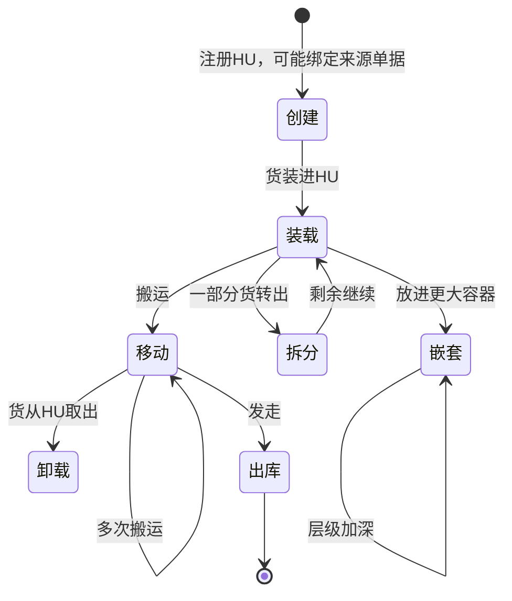

**追溯的三种查询**：

| 查询 | 路径 |
|---|---|
| 这个 HU 现在在哪？ | HU → 所在位置（或沿父级到顶层） |
| 这个 HU 从哪来？ | HU → 装载明细 → 批次 → 来源单据 |
| 这个 HU 到哪去？ | HU → 出库事件 → 出库单 |

### 3.5 容器嵌套与层级

HU 可以嵌套（托盘装箱子、箱子装盒子、盒子装瓶），形成树状结构。

**叶子 HU** 是嵌套树最底层、直接承载货物明细的 HU（如下图的瓶子）；内部 HU（如托盘、箱子、盒子）本身不直接装货，只承载下层子 HU。追溯批次的入口是叶子 HU 的装载明细。

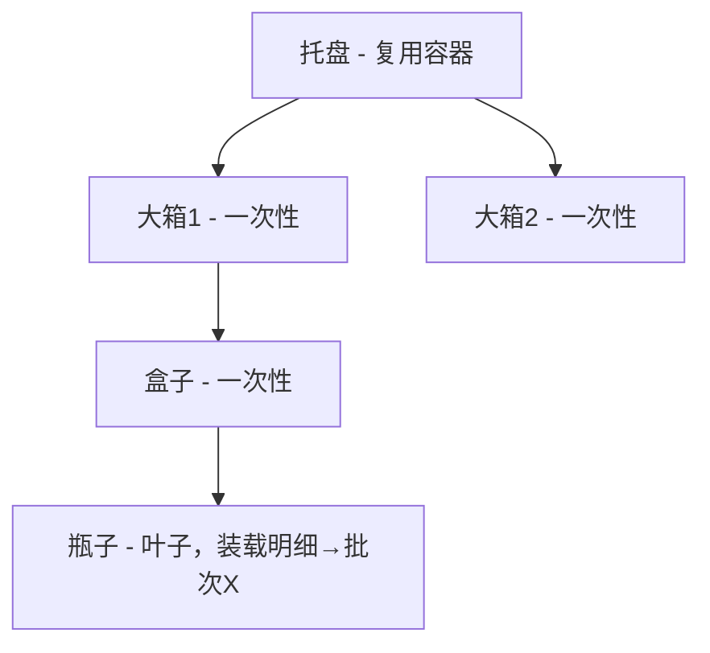

**两类 HU 的生命周期不同**：

| HU 类型 | 生命周期 | 历史数据稳定性 | 追溯方式 |
|---|---|---|---|
| 容器级（托盘） | **反复利用**，层级会变 | 会变 | 出库层级靠快照锁死 |
| 个体级（箱/盒/瓶） | **一次性**，出库即终结 | 永不改 | 装载明细永久保留 |

**在库追溯（跟随式）**：容器移动时只记容器一条事件，子 HU 跟随不记——子 HU 的位置由顶层祖先派生。避免事件爆炸。子 HU 独立移动（拆分、从容器取出）时才单独记录。

**出库追溯（层级快照）**：出库时保存完整嵌套关系的快照，**不可变**，并保留每个叶子 HU 当时的批次链接。用于层级关系上传外部、已出库码的批次追溯。

### 3.6 装载明细保留

出库后，HU 的**装载明细不删除**，标记为"已出库"，数量原样保留。

这保证两个数量不混淆：
- **物理库存数量**：出库扣减为 0（实时库存视角）
- **HU 装载明细数量**：永久保留（追溯视角）

扫一个已出库的 HU，仍能查到：数量 + 批次 + 库存主体。

### 3.7 产品召回

严格追溯（箱/盒/瓶都贴码）的真正目的是**产品召回**，锚点是**批次**而非个体。

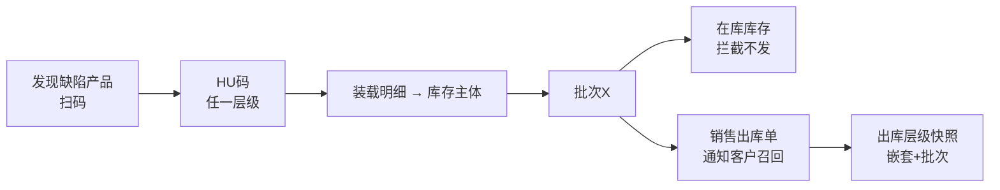

召回链路每个环节：
1. HU码 → 批次：叶子 HU 装载明细 → 库存主体 → 批次；内部 HU 向下遍历到叶子；已出库的码靠出库快照保留的批次链接
2. 批次 → 在库其他库存：批次实体 → 多个库存主体 → 物理库存（拦截用）
3. 批次 → 销售出库单：出库明细关联的批次 → 出库单

**关键洞察**：召回锚定批次，不锚定个体 → 不需要"每个 HU 在库期间每个时刻的位置"，只需要"出库时的层级关系 + 批次"。

### 3.8 叶子 HU 粒度可配置

同一个嵌套模型，在不同深度"切一刀"，就得到不同的管理模式。

| 模式 | 叶子 HU 在哪 | 账目怎么记 | 追溯深度 |
|---|---|---|---|
| 粗粒度 | 箱 | 只记箱的数量 | 到箱 |
| 箱级+清单 | 箱 | 记箱数量 + 箱内码清单（外部告知） | 到箱，箱内码可查 |
| 精细 | 瓶 | 从瓶建 HU，逐层嵌套 | 到瓶/个体 |

- 结构不变，变的只是"从哪一层开始管理、到哪一层为止"
- **粒度切换向前生效，不可回溯**：只能在新入库的货上启用更细粒度，已入库的历史货无法补

---

## 四、入库与出库的账目流转

### 4.1 入库链路

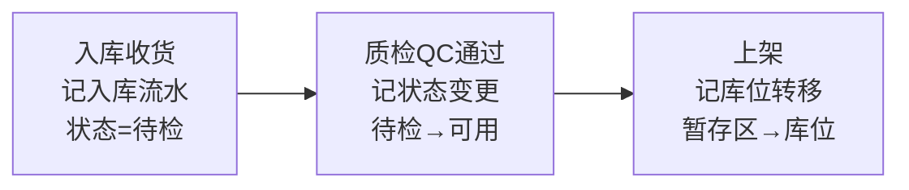

- 待检是货的**状态**（业务不可用），不是库位类型
- 收货、QC（Quality Control，质检）、上架各自记一笔，审计完整看到"入库到可用"的链路

### 4.2 出库链路

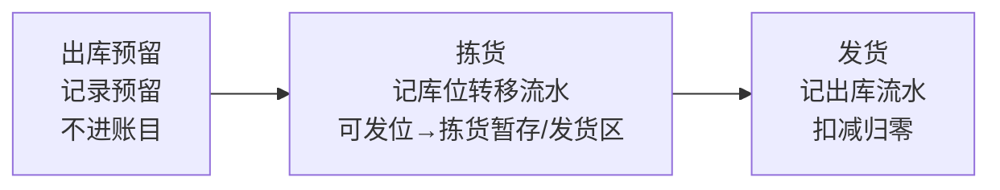

**承诺不进账，动作进账**：预留（额度承诺）只在预留记录里，拣货和发货（实际动作）才进账目。

### 4.3 出库边界

- 货沿库位链移动，每个中间环节（拣货暂存/复核/发货区）都是真实库位，货在哪个环节账上就在哪
- **发货确认 = 扣减归零**：货离开仓库那刻，物理库存归零并归档，不再作为在库库存；流水留一条"出库"记录，是最后痕迹
- **"已出库"不是库存状态，是流水历史**

---

## 五、实时库存与可用量

### 5.1 三件事：冻结 / 盘点 / 出库预留

围绕"货能不能用"，有三种不同的约束，**本质不同**：

| 场景 | 约束的对象 | 粒度 | 生命周期 | 表达方式 | 进不进账目 |
|---|---|---|---|---|---|
| **冻结** | 货的身份 | 库存主体 | 持久，直到解冻 | 状态变更 | 进（记流水） |
| **盘点** | 位置的范围 | 整库位 | 临时，带时间窗口 | 独立锁定 | 不进 |
| **出库预留** | 数量的额度 | 批次+数量 | 跟随单据 | 预留记录 | 不进 |

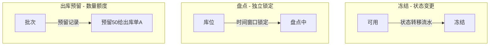

### 5.2 为什么三种机制不同

- **冻结 = 状态变更**：货的属性变了（"这批货就是不能用"），持久，要记流水（审计能看到冻结时点）
- **盘点 = 位置锁定**：临时动作（"暂时别动，我要数数"），锁的是位置范围不是货属性；用独立锁定记录，避免污染账目历史
- **出库预留 = 数量额度**：锁的是"批次的额度"，不是具体货（分配时货还没定，同批次内可换源）

### 5.3 统一可用量公式

```
可用量 = Σ(状态=可用 且 库位未被盘点锁定 的物理库存) − 出库预留(未释放)
```

**金融类比**：账目=银行账户余额，预留/锁定=信用卡预授权（钱暂时不能用，但余额没变）。

这不违反"流水可重建"——**可重建的是"货的真实库存"，不是"可用量"**。可用量是实时计算的派生值，不是历史事实。

---

## 六、追溯与实时库存如何互相支撑

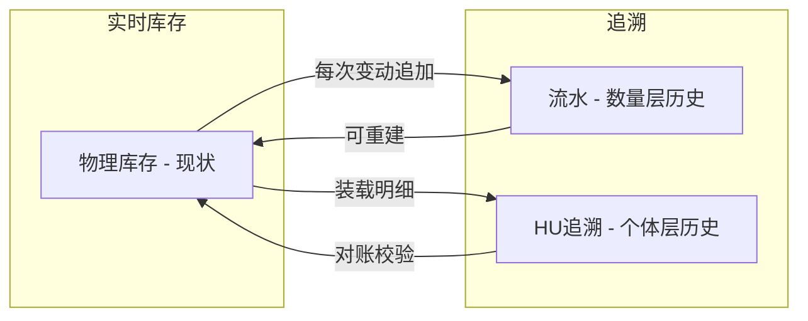

- 实时库存（物理库存）是"投影"，追溯（流水）是"真相"——两者互为支撑
- 数量层追溯靠流水，个体层追溯靠 HU——两者服务于不同粒度的查询

---

## 七、概念总览

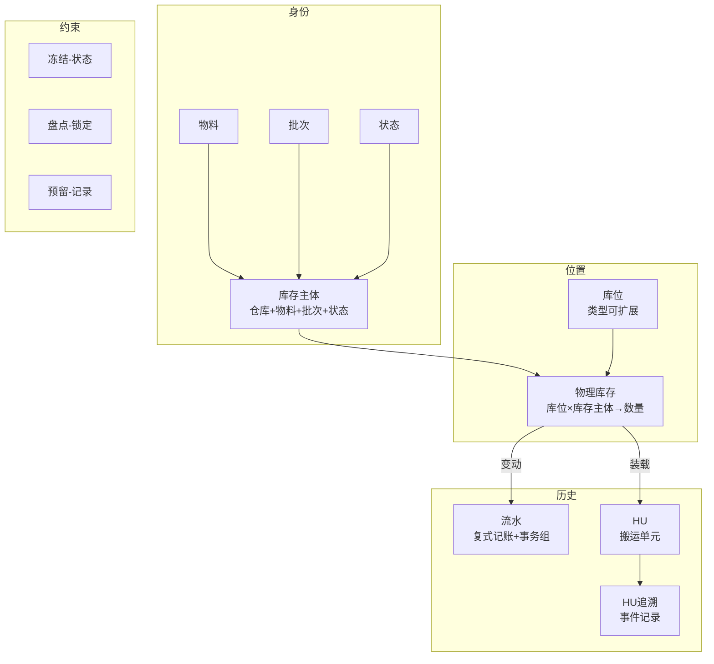

---

## 八、历史变更记录

> 本文档为初始版本，从《库存账目设计-正式版》重组而来：剔除任务/执行相关内容（纯搬运归任务模块），改为围绕"实时库存"与"追溯"两大需求组织，全部概念用中文描述，图表用 Mermaid。

| 日期 | 变更 |
|---|---|
| 2026-08-05 | 初始版本：概念设计重组 |
